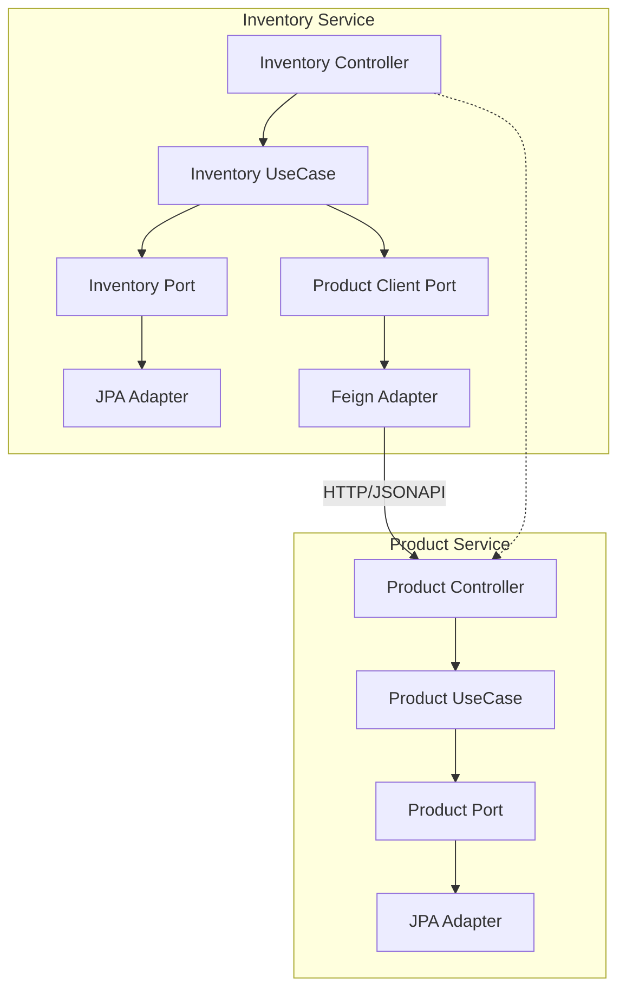
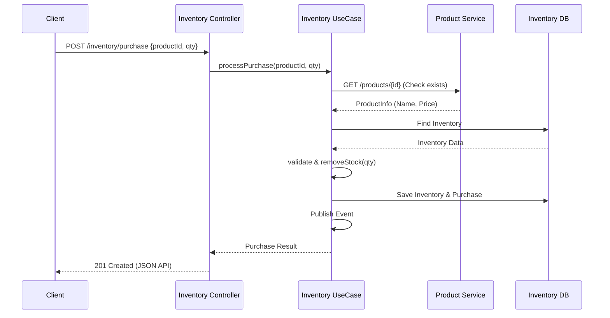

# Microservicios de Productos e Inventario - Linktic (Senior/Tech Lead Edition)

Solución robusta de microservicios siguiendo **Arquitectura Hexagonal (Puertos y Adaptadores)**, diseñada para ser escalable, resiliente y mantenible.

## Arquitectura y Patrones

### 1. Hexagonal Pura
- **Dominio**: Clientes Java puros sin dependencias de infraestructura. Lógica de negocio encapsulada en entidades (`Product`, `Inventory`, `Purchase`).
- **Aplicación**: Casos de uso (Use Cases) que orquestan el flujo de negocio mediante Puertos.
- **Infraestructura**: Adaptadores para REST (OpenAPI), JPA (PostgreSQL), Feign (Resilience4j) y Eventos.

### 2. Diagramas

#### Diagrama de Componentes


#### Flujo de Compra (Secuencia)


### 3. Patrones de Diseño
- **Mapper (MapStruct)**: Desacoplamiento total entre modelos de API, Dominio y Persistencia.
- **Resilience (Circuit Breaker & Retry)**: Implementado en el adaptador de cliente de productos para manejar fallos externos.
- **Domain Events**: Emisión de eventos internos ante cambios de estado, listos para escalabilidad asíncrona.

## Microservicios

### Product Service (Port: 8081)
- Gestión de catálogo.
- API versionada en los endpoints (ej. `/api/v1/products`).

### Inventory Service (Port: 8082)
- Gestión de existencias y **Historial de Compras**.
- Orquestación de compra: Valida producto -> Descuenta stock -> Registra compra -> Emite evento.

## Resiliencia y Seguridad
- **Resilience4j**: Retry (3 intentos con exponencial backoff) y Circuit Breaker para llamadas a Product Service.
- **Seguridad**: Filtro de API Key (`X-API-KEY`) implementado como interceptor de infraestructura.
- **Transaccionalidad**: Uso de `@Transactional` para asegurar atomicidad en el flujo de compra.

## Ejecución y Mantenimiento

### Docker Optimizado
```bash
docker-compose up --build
```
*Incluye health checks para asegurar que la DB esté lista antes de que las apps arranquen, evitando errores de conexión.*

### Observabilidad
- **Actuator**: `/actuator/health` en ambos servicios (solo salud expuesta).
- **Swagger**:
    - [Product API](http://localhost:8081/api/v1/swagger-ui/index.html)
    - [Inventory API](http://localhost:8082/api/v1/swagger-ui/index.html)

## Decisiones Técnicas y Justificación

### Justificación de Base de Datos (PostgreSQL)
Se eligió **PostgreSQL** sobre SQLite o NoSQL por las siguientes razones:
1.  **Transaccionalidad (ACID)**: Crítico para la gestión de inventario y compras, asegurando que no haya pérdida de datos o inconsistencias.
2.  **Integridad Referencial**: Permite asegurar que los registros de compras siempre apunten a productos válidos (aunque en este caso el acoplamiento sea débil por ser microservicios).
3.  **Escalabilidad**: Preparado para entornos de producción de alta concurrencia.

### Ubicación del Endpoint de Compra
El endpoint de compra se implementó en el **Inventory Service** porque:
- El recurso principal afectado es el **Stock (Inventario)**.
- El servicio de inventario es el que debe garantizar la atomicidad de la operación: verificar existencias y descontar en una sola transacción.
- Evita que el servicio de productos tenga que conocer detalles de lógica transaccional de ventas.

## Uso de Herramientas de IA
Durante el desarrollo se utilizaron herramientas de IA (**Antigravity**) para:
- **Generación de Boilerplate**: Creación de mappers y DTOs basados en el estándar JSON API.
- **Refactorización Arquitectónica**: Implementación del desacoplamiento entre capas y corrección de tipos (UUID).
- **Documentación**: Generación de diagramas Mermaid y redacción de justificaciones técnicas.
- **Verificación de Calidad**: Sugerencias sobre el uso de Resilience4j y transaccionalidad.

## Guía de Escalabilidad Futura 

1.  **Event-Driven Architecture (EDA)**: Migrar los eventos de dominio locales a un bus de eventos (Kafka/RabbitMQ) para desacoplar completamente el registro de compras del descuento de inventario (Saga Pattern).
2.  **API Gateway**: Implementar Spring Cloud Gateway para centralizar la autenticación, rate limiting y el ruteo de versiones.
3.  **Caché**: Añadir Redis para el catálogo de productos en el servicio de inventario para reducir llamadas HTTP.
4.  **Monitoreo**: Integrar Prometheus y Grafana para visualizar métricas de Resilience4j y salud del sistema.
