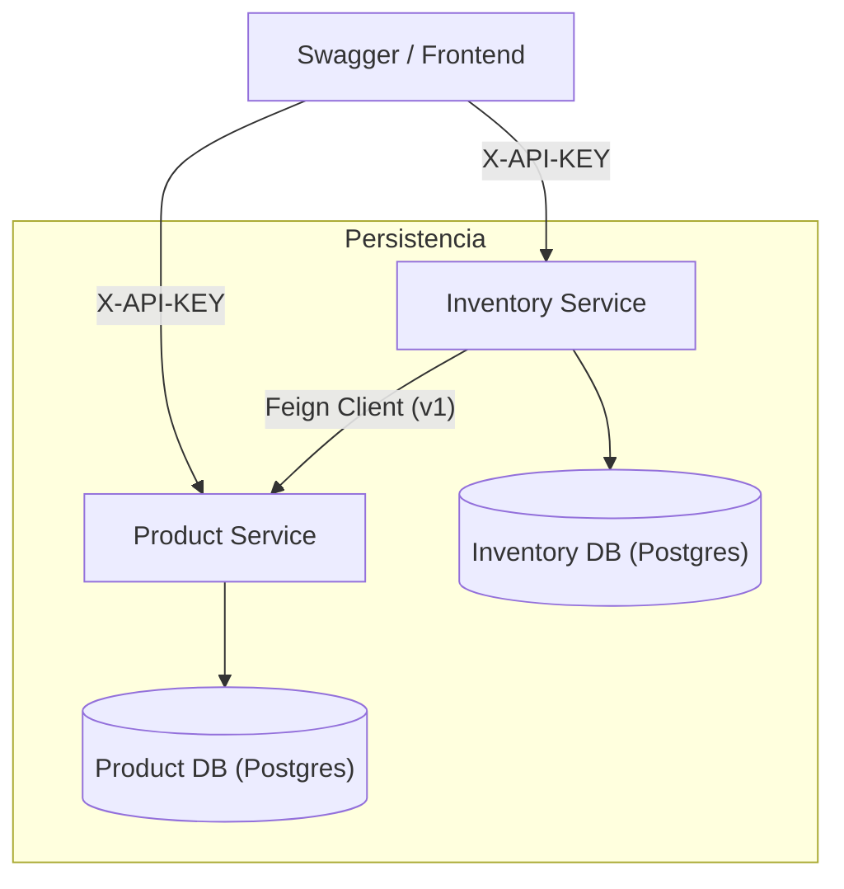
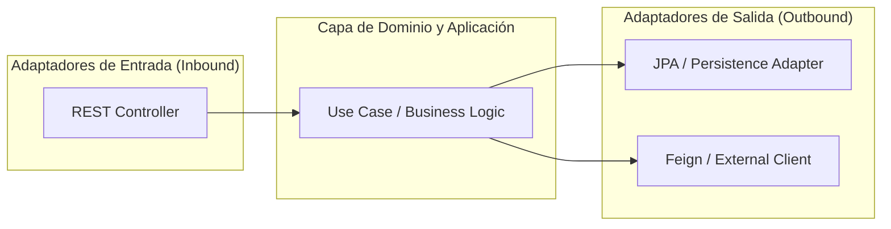
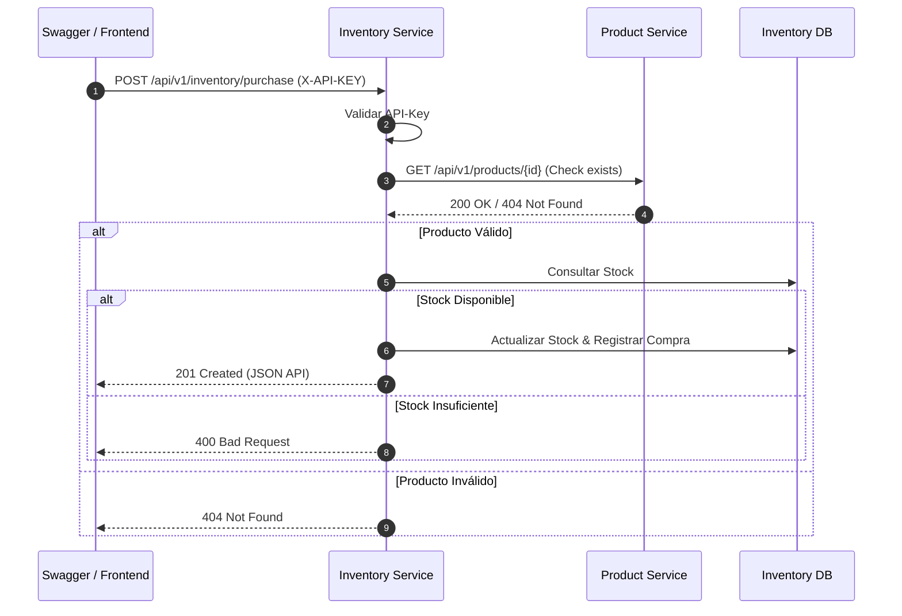

# Arquitectura Técnica del Sistema

Este documento describe la estructura y el flujo de comunicación entre los microservicios, enfocándose en la implementación de la **Arquitectura Hexagonal** y las buenas prácticas de diseño.

## 1. Visión General del Sistema

El sistema consta de dos microservicios principales que interactúan para gestionar productos y procesar compras, protegidos por autenticación basada en **API-Key**.

---

## 2. Arquitectura Hexagonal (Puertos y Adaptadores)

Cada servicio está estructurado para desacoplar la lógica de negocio de los detalles tecnológicos.

### Estructura de Componentes

- **Puertos (Ports)**: Interfaces que definen *qué* puede hacer el sistema (ej. `ProductRepositoryPort`).
- **Adaptadores (Adapters)**: Implementaciones técnicas de esos puertos (ej. `JpaProductAdapter`, `ProductFeignClient`).

---

## 3. Flujo de Compra y Comunicación

El flujo de compra demuestra la interacción entre servicios y la validación transaccional.

---

## 4. Seguridad: Autenticación por API-Key

Para asegurar la comunicación, ambos servicios implementan un filtro de seguridad:
- **Header**: `X-API-KEY`
- **Mecanismo**: Interceptor/Filtro en la capa de infraestructura que valida la clave antes de permitir el acceso a los Casos de Uso.
- **Inter-service**: El `Inventory Service` propaga o utiliza una clave válida para comunicarse con el `Product Service`.

---

## 5. Buenas Prácticas y Clean Code

- **Modelos de Dominio Puros**: Entidades sin anotaciones de persistencia (cuando es posible) o aisladas del modelo JPA.
- **Mapeo Explícito**: Uso de **MapStruct** para transformar datos entre capas (DTO -> Domain -> Entity).
- **Inmutabilidad**: Uso de objetos inmutables y UUIDs para identificadores.
- **Resiliencia**: Implementación de **Circuit Breaker** y **Retry** en las llamadas entre servicios para manejar fallos transitorios.
