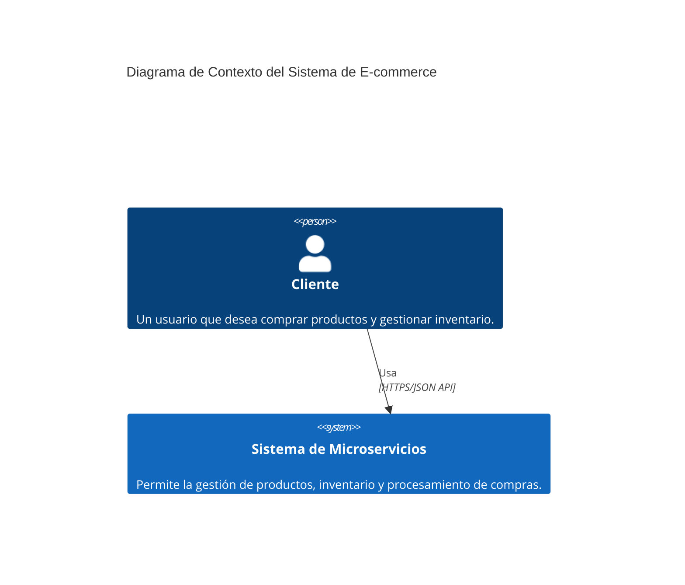
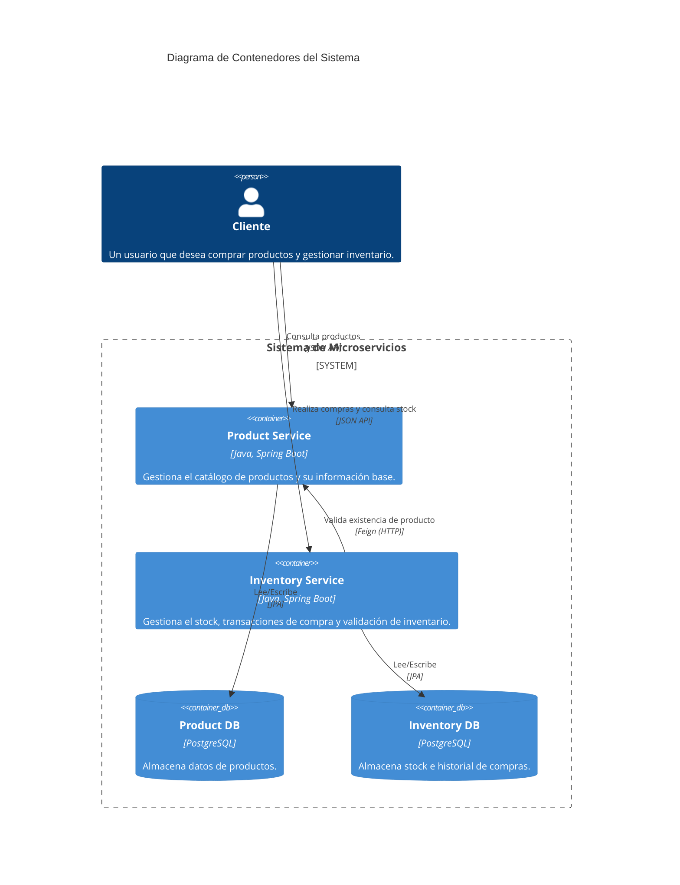
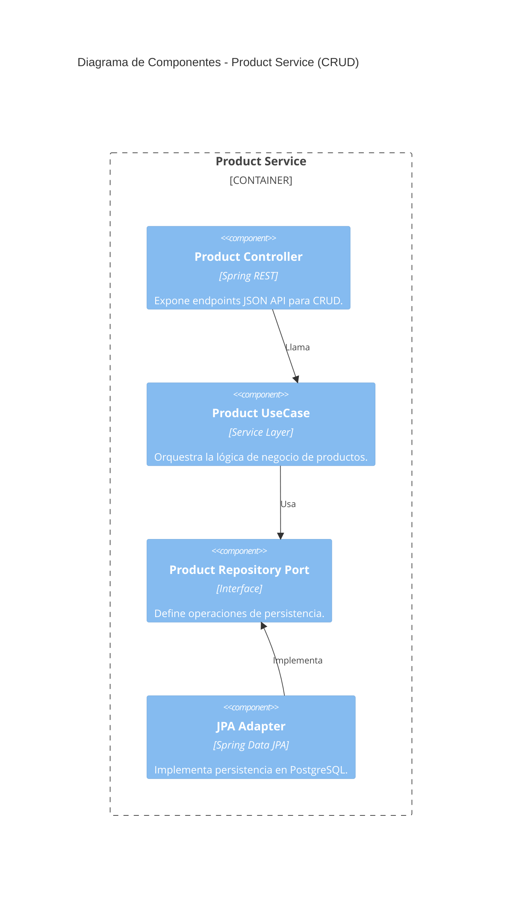
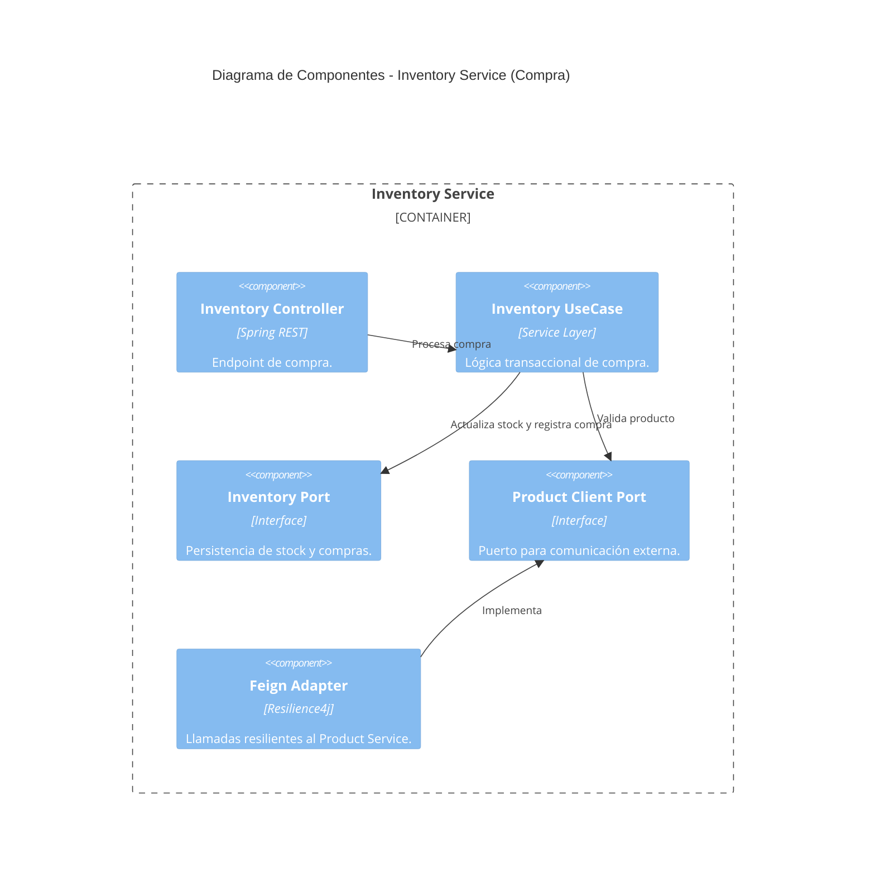

# Arquitectura del Sistema

Este documento describe la arquitectura del sistema de microservicios utilizando el modelo C4 para proporcionar diferentes niveles de abstracción.

## 1. Nivel 1: Diagrama de Contexto del Sistema

Muestra el sistema en su conjunto y cómo interactúa con los usuarios y otros sistemas.



## 2. Nivel 2: Diagrama de Contenedores

Desglosa el sistema en contenedores (aplicaciones, bases de datos, etc.).



## 3. Nivel 3: Diagrama de Componentes (Zoom-In)

### Product Service: CRUD de Productos

Muestra los componentes internos que facilitan la gestión de productos siguiendo la Arquitectura Hexagonal.



### Inventory Service: Funcionalidad de Compra

Muestra cómo se orquestan los componentes para procesar una compra.



## 4. Diagrama de Interacción: Proceso de Compra

Diagrama de secuencia detallado de una interacción exitosa de compra.

```mermaid
sequenceDiagram
    autonumber
    participant Client as Cliente
    participant IC as Inventory Controller
    participant IU as Inventory UseCase
    participant PC as Product Service
    participant IDB as Inventory DB

    Client->>IC: POST /inventory/purchase {productId, quantity}
    IC->>IU: processPurchase(productId, quantity)
    
    Note over IU, PC: Validación Externa
    IU->>PC: GET /products/{id}
    alt Producto Existe
        PC-->>IU: 200 OK (Product Info)
    else Producto No Existe
        PC-->>IU: 404 Not Found
        IU-->>IC: throw ProductNotFoundException
        IC-->>Client: 404 Error
    end

    Note over IU, IDB: Gestión de Stock
    IU->>IDB: Find Inventory for Product
    IDB-->>IU: Inventory Object
    
    IU->>IU: validateStock(quantity)
    alt Stock Suficiente
        IU->>IDB: Save Updated Stock & New Purchase
        IDB-->>IU: Success
        IU-->>IC: Purchase Confirmation
        IC-->>Client: 201 Created (JSON API)
## 5. Estrategia de Versionado de API

Para asegurar la evolución del sistema sin romper la compatibilidad con clientes existentes, se ha adoptado una estrategia de **versionado por ruta (Path Versioning)**.

- **Formato**: `/api/v{n}/[recurso]`
- **Estado Actual**: `v1` implementado en todos los endpoints públicos.
- **Transición**: Cuando se introduzcan cambios disruptivos (breaking changes), se desplegará una versión `v2` manteniendo `v1` activa durante un periodo de deprecación.

---

## 6. Propuesta de Escalabilidad y Mejoras

Como parte de la visión de Líder Técnico, se proponen las siguientes mejoras para el futuro:

1.  **Patrón Saga**: Implementar coreografía de eventos para manejar transacciones distribuidas entre Producto e Inventario de forma asíncrona.
2.  **API Gateway**: Introducir un punto de entrada único para centralizar seguridad, métricas y ruteo.
3.  **Observabilidad Distribuida**: Integrar OpenTelemetry para trazado de peticiones entre servicios (Distributed Tracing).
