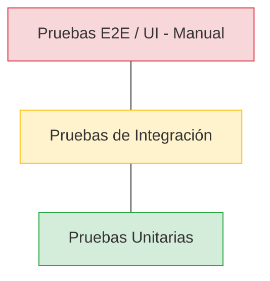

# Estrategia de Pruebas

Este documento detalla la lógica y el enfoque utilizado para asegurar la calidad y fiabilidad de los microservicios.

## 1. La Pirámide de Pruebas

Hemos adoptado la **Pirámide de Pruebas** como modelo para nuestra estrategia, priorizando las pruebas que proporcionan feedback rápido y son fáciles de mantener.



### Distribución de Pruebas:

1.  **Pruebas Unitarias (Base)**:
    *   **Enfoque**: Lógica de negocio pura en la capa de Dominio y Casos de Uso.
    *   **Aislamiento**: Uso intensivo de Mocks (Mockito) para dependencias de infraestructura.
    *   **Meta**: Cobertura exhaustiva de casos de éxito y manejo de errores.

2.  **Pruebas de Integración (Medio)**:
    *   **Enfoque**: Validar la interacción entre componentes (ej. Adaptador JPA con base de datos real o H2, Feign Clients).
    *   **Infraestructura**: Uso de `@SpringBootTest` y `@DataJpaTest`.
    *   **Meta**: Asegurar que las piezas de infraestructura se comunican correctamente con la base de datos y otros servicios.

3.  **Pruebas E2E / Contrato (Cima)**:
    *   **Enfoque**: Flujos completos desde el controlador hasta la persistencia.
    *   **Herramientas**: RestAssured o MockMvc.

---

## 2. Enfoque en Casos de Uso vs. Cobertura

En lugar de perseguir un porcentaje de cobertura de líneas de código (aunque se mantiene alto por naturaleza), nuestro enfoque principal es el **Testing basado en Casos de Uso**.

### Casos Críticos Cubiertos:

#### Gestión de Productos
- **Éxito**: Creación de un producto con datos válidos.
- **Error**: Intento de obtener un producto inexistente.

#### Proceso de Compra e Inventario
- **Éxito**: Compra exitosa con stock suficiente y producto válido.
- **Validación**: Registro correcto en el historial de compras tras la venta.
- **Error - Stock Insuficiente**: El sistema debe rechazar la compra si la cantidad solicitada supera el stock.
- **Error - Producto No Encontrado**: El sistema debe fallar si el servicio de productos no reconoce el ID solicitado.

#### Comunicación entre Servicios
- **Resiliencia**: Verificación de que el Circuit Breaker y los Reintentos funcionan cuando el servicio externo falla.
- **Integridad**: Mapeo correcto de respuestas JSON API entre servicios.

---

## 3. Ejecución de Pruebas

Para ejecutar todas las pruebas del proyecto:

```bash
# En la raíz del proyecto o en cada microservicio
mvn test
```
